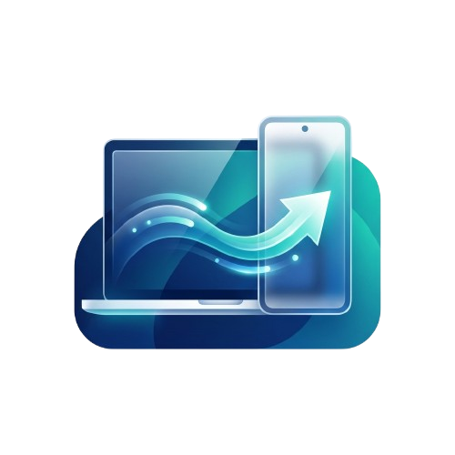

<p align="center">
  
</p>

# Mac2Pixel CLI

A premium, simple Command Line Interface to copy files between macOS and an Android (Pixel) phone via ADB. This tool bypasses the limitations of macOS not natively supporting MTP (Media Transfer Protocol).

## ✨ Features

- **Mac2Pixel**: Fast file/folder transfer from Mac to Pixel.
- **Pixel2Mac**: Convenient download of files/folders from Pixel to Mac.
- **Progress Tracking**: Real-time progress bars for transfers.
- **Multi-Device Support**: Easily target specific devices when multiple are connected.

## 🛠 Prerequisites

- **ADB (Android Debug Bridge)**: The tool uses ADB for file transfers.
- **Python 3.6+**: The scripts are written in Python.
- **USB Debugging**: Enabled on your Android device (Settings > System > Developer options).

## 🚀 Setup

1. **Install ADB** (if you haven't already):
   ```bash
   brew install --cask android-platform-tools
   ```

2. **Initialize the Python Environment**:
   ```bash
   python3 -m venv venv
   source venv/bin/activate
   pip install -r requirements.txt
   ```

## 📖 Usage

### 1. Mac to Pixel (`mac2pixel.py`)

Transfer files or folders from your Mac to your Pixel phone.

```bash
python3 mac2pixel.py <SOURCE_PATH> [DESTINATION_PATH]
```

- `<SOURCE_PATH>`: Path to the file/folder on your Mac.
- `[DESTINATION_PATH]`: (Optional) Path on your phone. Default: `/sdcard/Music/New`.

### 2. Pixel to Mac (`pixel2mac.py`)

Download files or folders from your Pixel phone to your Mac.

```bash
python3 pixel2mac.py [REMOTE_PATH] [LOCAL_PATH]
```

- `[REMOTE_PATH]`: (Optional) Path on your phone. Default: `/sdcard/Music/New`.
- `[LOCAL_PATH]`: (Optional) Path on your Mac. Default: `.` (current directory).

### Options:
- `-s, --device TEXT`: Specify a device ID if multiple devices are connected.

## 💡 Examples

**Copy music to phone:**
```bash
python3 mac2pixel.py ./MyAlbum
```

**Download downloads from phone:**
```bash
python3 pixel2mac.py /sdcard/Download ./MyDownloads
```

## 🔍 Troubleshooting

- **No devices found**: Ensure USB Debugging is enabled and you've authorized the computer on your phone's screen.
- **ADB not found**: Ensure `android-platform-tools` is installed and `adb` is in your PATH.
- **Permissions**: Ensure your phone's screen is unlocked during transfer.
